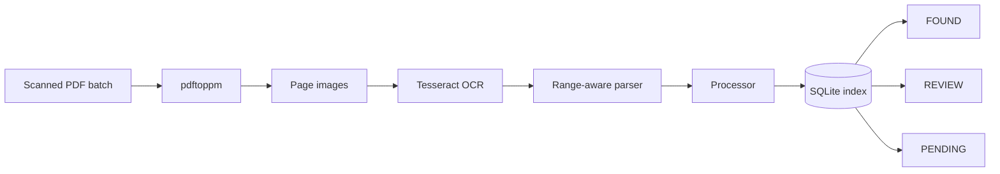

# Digital Receipt Book

> OCR-assisted document indexing for high-volume delivery receipts, built around searchable document numbers instead of PDF page numbers.

[](https://github.com/daviSilva-devv/digital-receipt-book/actions/workflows/ci.yml)


Digital Receipt Book is a **public-safe reconstruction of the processing core** behind a local document-operations prototype. A scanned PDF batch is rendered into pages, OCR extracts candidate receipt/invoice numbers, the parser filters them against an active numeric range, and SQLite keeps both located and still-missing documents explicit.

No real scanned documents, customer information, employer branding, credentials, or production databases are included. Public examples are synthetic.

## The problem

A large receipt archive is not useful when the only answer is _“it is somewhere around page 38 of one of these PDFs.”_

The operational lookup key is the **document number**. The system therefore models a receipt book as a numeric range and treats each OCR hit as evidence that must be indexed, reviewed, or left pending.



## What this repository demonstrates

| Concern | Public implementation |
| --- | --- |
| OCR parsing | labeled + generic document-number extraction with active-range filtering |
| Identity | document number is the primary operational lookup unit |
| Persistence | local SQLite with `STRICT` tables, foreign keys and WAL |
| Book integrity | overlapping numeric ranges are rejected |
| Duplicate evidence | repeated hits in one batch are surfaced as `REVIEW` |
| Missing documents | pending numbers are derived from the active book range |
| Native OCR boundary | explicit Poppler/Tesseract command contracts + preflight |
| Safety | synthetic fixtures only; no internal PDFs or customer data |
| Validation | 11 public automated tests + GitHub Actions CI |

## Try the synthetic demo

Requires **Node.js 22.5+** because the public reconstruction uses the built-in `node:sqlite` module.

```bash
npm run demo
```

Example output:

```text
DIGITAL RECEIPT BOOK / SYNTHETIC DEMO
book: 471460-471465
pages processed: 3
unique documents: 4
found: 471460, 471461, 471463, 471465
review: 471463
pending: 471462, 471464
```

Nothing is downloaded and no OCR binary is needed for this demo; it exercises the parser, processor and SQLite index with synthetic OCR text.

## Run the checks

```bash
npm test
npm run check
```

`npm run check` runs the automated core suite and the synthetic end-to-end demo.

For the native OCR boundary:

```bash
PDFTOPPM_PATH=/path/to/pdftoppm \
TESSERACT_PATH=/path/to/tesseract \
npm run preflight
```

On Windows, the same variables can point directly to `.exe` files.

## Core invariants

**01 — A book range cannot overlap another book.**  
Two archives owning the same document number would make lookup ambiguous, so overlap is rejected at creation time.

**02 — OCR is evidence, not truth.**  
Candidates are filtered by the active range, and duplicate evidence is surfaced for review rather than silently trusted.

**03 — Missing is a real state.**  
A document that has not been indexed remains visible through the derived pending range instead of disappearing from the workflow.

**04 — Public data stays synthetic.**  
The repository proves the workflow without exposing the documents or business data that originally motivated it.

## Repository map

```text
lib/
├─ native-tools.mjs       Poppler / Tesseract command contracts
├─ ocr/
│  └─ parser.mjs          OCR text -> document-number candidates
├─ processor.mjs          page processing + FOUND / REVIEW handling
└─ server/
   └─ db.mjs              SQLite schema + books / uploads / receipts

examples/
└─ synthetic-ocr-pages.json

scripts/
├─ demo.mjs               runnable synthetic workflow
└─ preflight.mjs          native dependency validation

tests/
├─ parser.test.mjs
├─ database.test.mjs
├─ processor.test.mjs
└─ native-tools.contract.test.mjs

docs/
├─ ARCHITECTURE.md
├─ DECISIONS.md
└─ ORIGINAL_VALIDATION.md
```

## Original workflow vs. public reconstruction

The internal prototype that inspired this repository was previously validated locally with OCR parser scenarios, SQLite checks, native Poppler + Tesseract OCR, processor integration, TypeScript checks and a production build.

This repository does **not** claim to be the original internal source tree. It reconstructs the portfolio-safe processing concepts from that validated workflow and keeps the boundary explicit. See [`docs/ORIGINAL_VALIDATION.md`](docs/ORIGINAL_VALIDATION.md).

## Engineering notes

- [`docs/ARCHITECTURE.md`](docs/ARCHITECTURE.md) — processing boundaries, data model and failure states
- [`docs/DECISIONS.md`](docs/DECISIONS.md) — why range ownership, SQLite, explicit review states and external OCR binaries were chosen
- [`docs/ORIGINAL_VALIDATION.md`](docs/ORIGINAL_VALIDATION.md) — what was validated in the original prototype vs. what is tested in this public repository

## Status

**Portfolio reconstruction / working public core.** The repository is intentionally narrow: it focuses on the document-processing and indexing mechanics rather than pretending the entire private application was recovered or republished.
