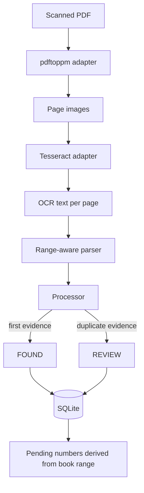

# Architecture

Digital Receipt Book models a document archive around the identifier people actually search for: the receipt/invoice number.



## Processing boundaries

### 1. Native tool boundary

Poppler and Tesseract are external executables. `lib/native-tools.mjs` builds deterministic command arguments, while `scripts/preflight.mjs` checks whether the required binaries are reachable through `PATH` or explicit environment variables.

The rest of the public core does not depend on a particular package manager or OS-specific installation layout.

### 2. OCR parser

`lib/ocr/parser.mjs` accepts OCR text and an active numeric range. It extracts:

- labeled values such as `NF 471460` or `CANHOTO 471461`;
- generic 5–9 digit candidates;
- only numbers inside the current book range.

Range filtering is intentional noise reduction. Large numeric identifiers such as CNPJ/CEP values can appear in OCR output and should not become receipts merely because they are numbers.

### 3. Processor

`lib/processor.mjs` processes page evidence and keeps a per-batch `seen` set.

- first hit in the batch -> `FOUND`;
- repeated hit in the same batch -> `REVIEW`;
- excerpt around the candidate -> stored as evidence for later inspection.

The processor does not silently resolve ambiguity.

### 4. SQLite index

`lib/server/db.mjs` owns four tables:

```text
users
  └─ books
      └─ uploads
      └─ receipts
```

Important database properties:

- `STRICT` tables;
- foreign keys enabled;
- WAL journal mode;
- unique `(book_id, document_number)` identity;
- non-overlapping book ranges enforced by application logic;
- upsert preserves one canonical row per document number inside a book.

## State model

```text
not indexed
    |
    +----> FOUND   first usable evidence
    |
    +----> REVIEW  duplicate/ambiguous evidence

PENDING is derived, not stored:
book range - indexed document numbers = pending numbers
```

Keeping `PENDING` derived avoids pre-creating thousands of rows solely to represent absence.

## Failure philosophy

- invalid page number -> reject input;
- invalid/overlapping book range -> reject creation;
- document outside active range -> reject persistence;
- duplicate evidence -> surface `REVIEW`;
- missing native binary -> preflight failure;
- missing receipt -> remains visible in the derived pending set.

## Public boundary

Only synthetic OCR fixtures belong in the public repository. The architecture is portable; the source documents and original business data are not.
